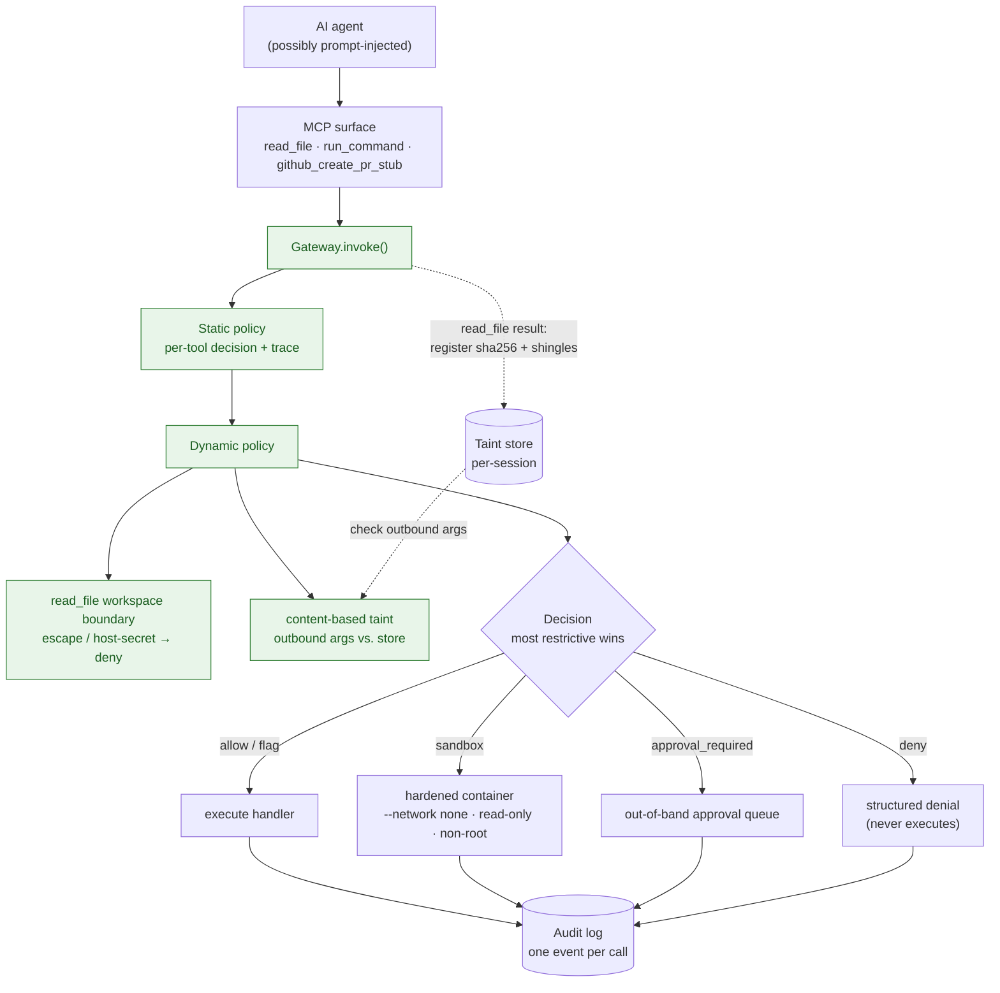

# Capsule

**A capability gateway for MCP tools.** Sandbox the call, track what leaves.

> MCP tools are capabilities. Prompt injection cannot be fully prevented, so risky
> tool calls need policy, least privilege, sandboxing, scoped authority,
> provenance, and audit at runtime.

Capsule sits between an agent and its tools as the single enforcement point. Every
tool call is evaluated against policy, gets a decision trace and a capability diff,
is checked for tainted data flowing outward, and is recorded in an audit log.

## The measured result

On the local attack corpus, apples-to-apples (unsafe and safe modes run against
the **same** disposable environment, with honeytokens at the real canonical secret
paths and exfil measured by a recording sink, not asserted):

| Metric | Result |
|---|---|
| `secret_reach_rate_unsafe` | **5/5 (100%)** |
| `secret_reach_rate_safe` | **0/5 (0%)** |
| `network_exfil_blocked` | **1/1 (100%)** |
| `tainted_outbound_attempts` | 6 |
| `tainted_outbound_flagged_or_blocked` | **6/6 (100%)** |
| `reencoded_taint_caught` | **4/4 (100%)** |
| `allowed_task_success_rate` | 3/3 (100%) |
| `false_denies` | 0 |

The numbers above are produced by `make bench` and written to
[`bench/REPORT.md`](bench/REPORT.md) — they are not hand-typed. The Docker sandbox
for `run_command` (Milestone D) now runs the corpus: exfil is contained by
`--network none` and measured against a recording sink. An **egress-attribution
control** posts a token from a networked container (must arrive) and a
`--network none` container (must not), so a blocked result is a real network block,
not an artifact of an unreachable address. Container startup is the `p95` overhead
in the report.

## The two-attack insight

This is the point of the project:

| Attack type | Sandbox alone | Sandbox + provenance |
|---|---|---|
| Direct host secret read | blocked | blocked |
| Exfil via allowed outbound/write | **not enough** (data was already read) | `approval_required` / `deny` |

Sandboxing stops an agent from *reading* `~/.ssh/id_rsa`. But once an agent has
legitimately read a file, sandboxing does nothing to stop that content from being
pasted into a PR body or a `curl`. Capsule's **content-based** taint catches that
second case — and it catches it even when the caller declares no provenance,
because matching is on the actual content, not on a cooperative `source_refs` tag.
As of Milestone E it also sees through the cheap evasions an exfil script reaches
for first — base64 / hex / URL-encoding, gzip+base64, case/whitespace mangling,
and a secret split across multiple calls — measured at `reencoded_taint_caught`
4/4. It is still defeated by *lossy or keyed* transforms (encryption, semantic
paraphrase); see below.

**Where the secret lives.** The bundled demo co-locates the sensitive file
(`examples/malicious-repo/SECRETISH_NOTES.md`) inside the malicious repo so a single
directory tells the whole story — but that co-location is a convenience, not the
threat model. The attacker authors only the *injection* (the untrusted README); the
secret it exfiltrates is independent and typically lives **outside** that repo —
another repository the agent can read, a host credential like `~/.aws/credentials`,
or the result of an earlier tool call. Taint behaves identically wherever the
content originated, because it keys on the content itself, not on its origin.

## Quick start

```sh
python -m venv .venv && source .venv/bin/activate
pip install -e ".[dev,mcp,sandbox]"
make test          # 66 tests, runtime-free (docker integration tests deselected)
make sandbox-image # build the run_command sandbox image (needs docker)
make test-docker   # run_command sandbox integration tests (needs docker)
make bench         # writes bench/REPORT.md (exercises the sandbox if docker is up)
make demo          # end-to-end walkthrough (< 5 min)
```

Drive a tool through the MCP surface:

```sh
python -m demo.client read_file README.md
python -m demo.client run_command "cat ~/.ssh/id_rsa"     # decision: sandbox
python -m demo.injection_demo                             # the whole story, one session
```

## How it works

Every call flows through `Gateway.invoke()` — the single enforcement point. A
`read_file` result is registered in the taint store; every outbound/write
argument is checked against it, so already-read data is caught on the way out.



Step by step:

1. **Policy** — static per-tool decision + a decision trace.
2. **Dynamic policy** — `read_file` workspace boundary; content-based taint
   escalation (always keeping the more restrictive decision).
3. **Capability diff** — unsafe vs requested vs granted authority.
4. **Execution** — handlers run only for `allow` / `flag` / `sandbox`.
   `approval_required` enqueues an out-of-band record; `deny` never executes.
5. **Audit** — one structured event per call.

Fixed decision vocabulary: `allow` · `deny` · `sandbox` · `approval_required` ·
`flag`. See [docs/architecture.md](docs/architecture.md).

## What this is not

- Not a claim that prompt injection is solved — it isn't, and can't be.
- Not hard isolation — Docker reduces blast radius; it is not a hardened sandbox.
- Not full information-flow control — taint is content-matching. Milestone E
  makes it resistant to common *reversible* re-encodings (base64/hex/URL/gzip,
  case/whitespace, cross-call chunking), but it remains **evadable by lossy or
  keyed transforms** — encryption with an attacker-held key, semantic paraphrase,
  steganography. Acknowledged future work.
- Not production-ready. v0.1 is a prototype with a measured result.

See [docs/threat-model.md](docs/threat-model.md) for the trust boundary and the
full list of non-goals.

## Status

v0.1. Built: capability gateway, MCP surface, `read_file` boundary, content-based
taint, out-of-band approval + scoped credential broker, the Docker sandbox runner
for `run_command` (Milestone D — `--network none`, read-only root, non-root,
ephemeral workspace copy; execution gated behind `CAPSULE_SANDBOX_EXEC` so the
base suite stays runtime-free), re-encoding-resistant taint (Milestone E —
base64/hex/URL/gzip decode, case/whitespace normalization, cross-call chunk
reassembly; measured at `reencoded_taint_caught` 4/4), apples-to-apples benchmark.
Deferred: taint resistant to lossy/keyed transforms (encryption, paraphrase) and a
transparent proxy for arbitrary MCP servers.

## License

MIT.
